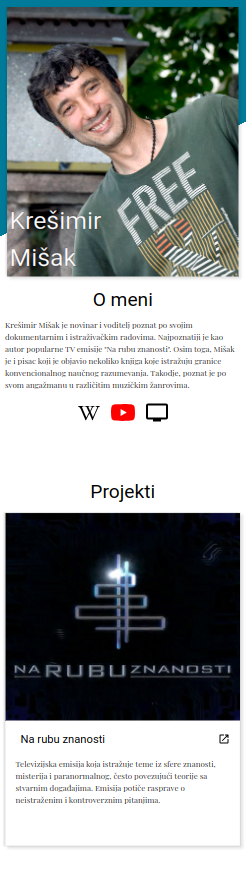
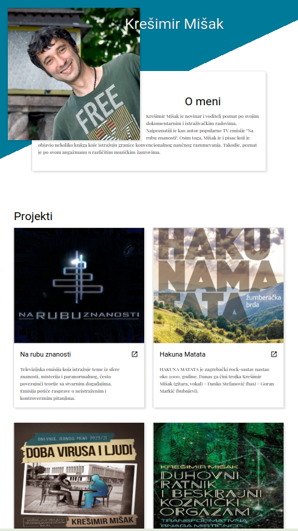
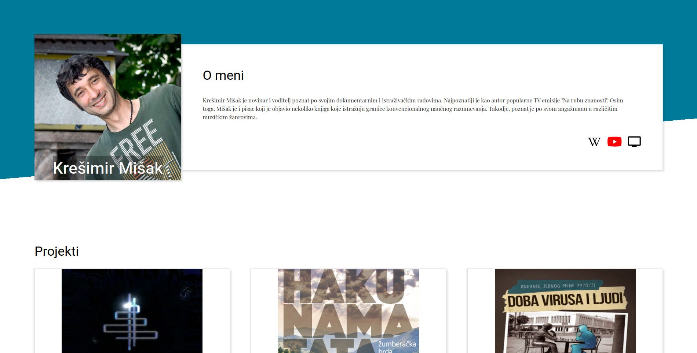

# Krešimir Mišak Fan Page

This [project](https://www.theodinproject.com/lessons/node-path-advanced-html-and-css-homepage) is a showcase of advanced HTML and CSS techniques to create a visually appealing and responsive fanpage. The goal is to practice layout design, modern CSS features, and accessibility principles, resulting in a polished and professional web page.

## Screenshots

- **Mobile View**  
  

- **Tablet View**  
  

- **Desktop View**  
  

## Live Demo

You can view the live project by visiting the following URL:  
[Krešimir Mišak Fan Page] TBA (https://example.com)

## Features

- **Responsive Design**: Optimized for a seamless experience across desktop, tablet, and mobile devices.
- **Semantic HTML**: Uses semantic elements to ensure better accessibility and SEO.
- **Modern CSS Techniques**:
  - Flexbox and Grid for layout.
  - Custom properties for consistent theming.
  - Transitions and animations for smooth interactions.

---

### Possible Enhancements

- **Performance Optimization**: Minimize CSS and inline critical styles for faster load times.

---

### License

This project is licensed under the Beerware License. For more details about the terms and conditions of this license, refer to the official documentation: [Beerware License](https://people.freebsd.org/~phk/).

---

### Author

Created by : [Stefan Ljiljak](www.linkedin.com/in/stefan-ljiljak/). Feel free to reach out for any suggestions or questions!
